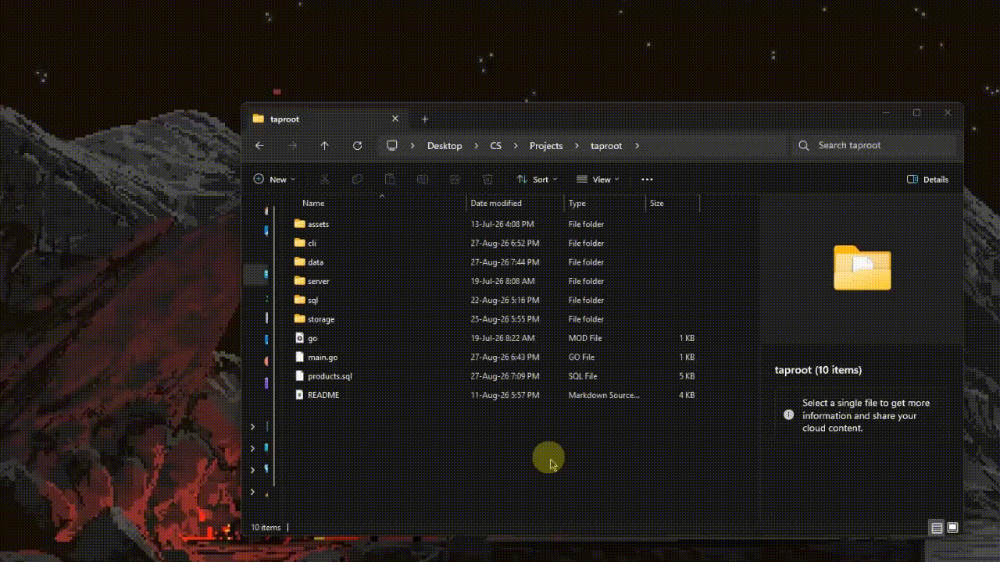

# 🌱 Taproot

> **A database built from scratch in Go — from raw TCP sockets to bytes on disk.**

Taproot is a learning-focused relational database built without relying on an existing database engine, HTTP framework, ORM, or storage library.

It implements its own:

* 🌐 HTTP server over raw TCP sockets
* 🧩 HTTP request/response parsing
* 📝 SQL tokenizer
* 🌳 SQL parser and AST
* ⚙️ SQL execution engine
* 🌲 B+ tree storage engine
* 💾 Persistent page-based storage
* 🗂️ Database catalog
* 🐍 Python command-line client

The goal isn't to compete with PostgreSQL or SQLite.

The goal is to understand **how a database actually works underneath the abstractions**.

---


<div align="center">


## ✨ Why Taproot?

Most applications interact with databases through layers of abstractions:

```text
Application
    ↓
ORM
    ↓
Database driver
    ↓
SQL database
    ↓
Storage engine
    ↓
Filesystem
```

Taproot intentionally removes most of those layers.

```text
Python CLI
     │
     │ HTTP
     ▼
Raw TCP HTTP Server
     │
     ▼
SQL Tokenizer
     │
     ▼
SQL Parser
     │
     ▼
AST
     │
     ▼
SQL Executor
     │
     ▼
Catalog
     │
     ▼
B+ Tree
     │
     ▼
Pager
     │
     ▼
Database Files
     │
     ▼
Disk
```

This makes Taproot useful as a **database-engineering project, educational resource, and experimental playground**.

---

# 🚀 Features

| Feature                                | Status            |
| -------------------------------------- | ----------------- |
| Raw TCP HTTP server                    | ✅ Implemented     |
| HTTP request parsing                   | ✅ Implemented     |
| HTTP JSON responses                    | ✅ Implemented     |
| SQL tokenizer                          | ✅ Implemented     |
| SQL parser                             | ✅ Implemented     |
| SQL AST                                | ✅ Implemented     |
| `CREATE TABLE`                         | ✅ Implemented     |
| `DROP TABLE`                           | ✅ Implemented     |
| `SHOW TABLES`                          | ✅ Implemented     |
| `DESC` / `DESCRIBE`                    | ✅ Implemented     |
| `INSERT`                               | ✅ Implemented     |
| `SELECT`                               | ✅ Implemented     |
| `UPDATE`                               | ✅ Implemented     |
| `DELETE`                               | ✅ Implemented     |
| `WHERE` expressions                    | ✅ Implemented     |
| `AND` / `OR`                           | ✅ Implemented     |
| B+ tree insertion                      | ✅ Implemented     |
| B+ tree search                         | ✅ Implemented     |
| B+ tree range scanning                 | ✅ Implemented     |
| B+ tree deletion                       | ✅ Implemented     |
| Leaf splitting                         | ✅ Implemented     |
| Internal-node splitting                | ✅ Implemented     |
| Persistent storage                     | ✅ Implemented     |
| Page allocation/free-list              | ✅ Implemented     |
| Database catalog persistence           | ✅ Implemented     |
| Python interactive CLI                 | ✅ Implemented     |
| CLI batch mode                         | ✅ Implemented     |
| Multi-line SQL in CLI                  | ✅ Implemented     |
| SQL syntax highlighting                | ✅ Implemented     |
| Joins                                  | ❌ Not implemented |
| Transactions                           | ❌ Not implemented |
| Indexes other than primary-key storage | ❌ Not implemented |
| Authentication                         | ❌ Not implemented |
| TLS/HTTPS                              | ❌ Not implemented |
| Query optimizer                        | ❌ Not implemented |
| Aggregations                           | ❌ Not implemented |

---

# 🏗️ Architecture

Taproot is split into several relatively independent layers.

```text
┌───────────────────────────────────────┐
│            Python CLI                 │
│  Interactive shell / Batch execution  │
└───────────────────┬───────────────────┘
                    │ HTTP
                    ▼
┌───────────────────────────────────────┐
│             HTTP Server               │
│      Raw TCP socket implementation     │
└───────────────────┬───────────────────┘
                    │ SQL
                    ▼
┌───────────────────────────────────────┐
│            SQL Layer                  │
│                                       │
│ Tokenizer → Parser → AST → Executor   │
└───────────────────┬───────────────────┘
                    │
                    ▼
┌───────────────────────────────────────┐
│              Catalog                  │
│      Schemas + table metadata         │
└───────────────────┬───────────────────┘
                    │
                    ▼
┌───────────────────────────────────────┐
│          B+ Tree Storage              │
│       Search / Insert / Delete        │
└───────────────────┬───────────────────┘
                    │
                    ▼
┌───────────────────────────────────────┐
│               Pager                   │
│   4096-byte pages + gob serialization │
└───────────────────┬───────────────────┘
                    │
                    ▼
                 Disk
```

---

# 📁 Project Structure

```text
taproot/
│
├── main.go
├── go.mod
│
├── server/
│   ├── server.go
│   ├── request.go
│   └── response.go
│
├── sql/
│   ├── tokenizer.go
│   ├── parser.go
│   ├── ast.go
│   ├── executor.go
│   └── catalog.go
│
├── storage/
│   ├── bPlusTree.go
│   ├── node.go
│   └── page.go
│
├── cli/
│   ├── cli.py
│   └── requirements.txt
│
├── assets/
│
└── README.md
```

---

# 🛠️ Requirements

## Server

Taproot currently uses:

* Go **1.26.5**
* A Unix-like or Windows environment capable of running Go
* TCP networking on port `8080` by default

The module currently declares:

```text
go 1.26.5
```

## CLI

The Python client requires:

* Python 3
* `requests`
* `prompt_toolkit`
* `rich`

Install the dependencies with:

```bash
pip install -r cli/requirements.txt
```

---

# ⚡ Quick Start

## 1. Clone the repository

```bash
git clone https://github.com/28-aditya/taproot.git
cd taproot
```

## 2. Start the database

```bash
go run main.go
```

By default, Taproot starts listening on:

```text
localhost:8080
```

The database files are stored in:

```text
./data
```

You can change the data directory with:

```bash
TAPROOT_DATA_DIR=./my-data go run main.go
```

On Windows PowerShell:

```powershell
$env:TAPROOT_DATA_DIR="./my-data"
go run main.go
```

---

# 🐍 Using the CLI

Open another terminal:

```bash
python cli/cli.py
```

You should see the Taproot shell.

```text
taproot SQL shell
connected to http://localhost:8080
type .help for meta-commands, end statements with ;
```

You can then execute SQL directly.

```sql
CREATE TABLE users (
    id INT PRIMARY KEY,
    name TEXT,
    age INT
);
```

Insert some data:

```sql
INSERT INTO users VALUES (1, 'Aditya', 21);
INSERT INTO users VALUES (2, 'Alice', 24);
INSERT INTO users VALUES (3, 'Bob', 19);
```

Query it:

```sql
SELECT * FROM users;
```

Example result:

```text
id | name | age
1  | Aditya | 21
2  | Alice  | 24
3  | Bob    | 19
```

---

# 📚 SQL Reference

Taproot currently supports the following statements:

```text
CREATE TABLE
DROP TABLE
SHOW TABLES
DESC
DESCRIBE
INSERT
SELECT
UPDATE
DELETE
```

SQL statements can optionally end with `;`.

---

## `CREATE TABLE`

### Syntax

```sql
CREATE TABLE table_name (
    column_name TYPE,
    column_name TYPE,
    ...
);
```

A primary key can be declared with:

```sql
CREATE TABLE users (
    id INT PRIMARY KEY,
    name TEXT
);
```

### Supported column types

| Type    | Aliases             | Stored value |
| ------- | ------------------- | ------------ |
| `INT`   | `INTEGER`           | Integer      |
| `TEXT`  | `STRING`, `VARCHAR` | String       |
| `FLOAT` | `REAL`, `DOUBLE`    | Float64      |
| `BOOL`  | `BOOLEAN`           | Boolean      |

Example:

```sql
CREATE TABLE products (
    id INT PRIMARY KEY,
    name VARCHAR,
    price FLOAT,
    available BOOLEAN
);
```

### Automatic `rowid`

If no primary key is specified, Taproot automatically adds:

```text
rowid INT PRIMARY KEY
```

For example:

```sql
CREATE TABLE users (
    name TEXT,
    age INT
);
```

is internally represented with an automatically generated `rowid`.

---

# `INSERT`

### Syntax

```sql
INSERT INTO table VALUES (...);
```

Example:

```sql
INSERT INTO users VALUES ('Aditya', 21);
```

You can also explicitly specify columns:

```sql
INSERT INTO users (name, age)
VALUES ('Aditya', 21);
```

For a table with an explicit primary key:

```sql
INSERT INTO users (id, name, age)
VALUES (10, 'Aditya', 21);
```

### Important behavior

If the primary key is omitted, Taproot generates the next `rowid`.

Explicit primary-key values must be unique.

---

# `SELECT`

### Select every column

```sql
SELECT * FROM users;
```

### Select specific columns

```sql
SELECT name, age FROM users;
```

### With filtering

```sql
SELECT * FROM users
WHERE age > 20;
```

### Supported comparison operators

```text
=
!=
<>
<
<=
>
>=
```

Examples:

```sql
SELECT * FROM users WHERE age = 21;

SELECT * FROM users WHERE age >= 18;

SELECT * FROM users WHERE name != 'Bob';
```

---

# `WHERE`

Taproot supports boolean expressions using:

```text
AND
OR
```

Examples:

```sql
SELECT *
FROM users
WHERE age >= 18 AND age < 30;
```

```sql
SELECT *
FROM users
WHERE name = 'Aditya' OR name = 'Alice';
```

Parentheses can be used to control expression grouping:

```sql
SELECT *
FROM users
WHERE (age >= 18 AND age < 30)
   OR name = 'Bob';
```

Expression precedence is:

```text
OR
 ↓
AND
 ↓
comparison
 ↓
primary expression
```

---

# `UPDATE`

### Syntax

```sql
UPDATE table
SET column = value
WHERE condition;
```

Example:

```sql
UPDATE users
SET age = 22
WHERE id = 1;
```

Multiple columns are supported:

```sql
UPDATE users
SET name = 'Aditya Kumar',
    age = 22
WHERE id = 1;
```

Values can also reference existing columns:

```sql
UPDATE users
SET age = age + 1
WHERE id = 1;
```

> **Note:** Although column references are supported inside expressions, arithmetic operators such as `+` are not currently supported by the SQL parser. Therefore the example above is **not currently valid**. Use literal assignments such as `SET age = 22`.

---

# `DELETE`

### Delete matching rows

```sql
DELETE FROM users
WHERE id = 1;
```

### Delete every row

```sql
DELETE FROM users;
```

Be careful: without a `WHERE` clause, every row in the table is deleted.

---

# `DROP TABLE`

```sql
DROP TABLE users;
```

This removes:

1. The table schema
2. The table from the catalog
3. The table's backing database file

This operation is destructive.

---

# `SHOW TABLES`

List all tables:

```sql
SHOW TABLES;
```

Example:

```text
table
users
products
orders
```

---

# `DESC` / `DESCRIBE`

Inspect a table's schema:

```sql
DESC users;
```

or:

```sql
DESCRIBE users;
```

Example:

```text
column | type | key
id     | INT  | PRIMARY KEY
name   | TEXT |
age    | INT  |
```

---

# 🧠 SQL Internals

Taproot processes SQL in four stages.

```text
SQL text
   │
   ▼
Tokenizer
   │
   ▼
Tokens
   │
   ▼
Parser
   │
   ▼
AST
   │
   ▼
Executor
   │
   ▼
Catalog / Storage
```

## 1. Tokenizer

`sql/tokenizer.go`

The tokenizer converts SQL text into tokens.

For example:

```sql
SELECT name FROM users WHERE age >= 18;
```

becomes conceptually:

```text
SELECT
IDENT(name)
FROM
IDENT(users)
WHERE
IDENT(age)
>=
INT(18)
;
EOF
```

Supported token categories include:

```text
Identifiers
Keywords
Integers
Floats
Strings
Operators
*
,
(
)
;
EOF
```

The tokenizer also recognizes quoted strings using either:

```sql
'hello'
```

or:

```sql
"hello"
```

---

# 2. Parser

`sql/parser.go`

The parser consumes the token stream and produces an AST.

The parser currently recognizes:

```text
SELECT
INSERT
UPDATE
DELETE
CREATE TABLE
DROP TABLE
DESC
DESCRIBE
SHOW TABLES
```

Expressions are parsed using precedence climbing:

```text
OR
 ↓
AND
 ↓
comparison
 ↓
primary
```

This lets expressions such as:

```sql
WHERE age > 18 AND active = TRUE
```

be represented structurally rather than evaluated directly from strings.

---

# 3. AST

`sql/ast.go`

The AST provides Go representations of SQL statements and expressions.

The major concepts are:

```text
Statement
 ├── CreateTableStmt
 ├── DropTableStmt
 ├── DescribeStmt
 ├── ShowTablesStmt
 ├── InsertStmt
 ├── SelectStmt
 ├── UpdateStmt
 └── DeleteStmt

Expr
 ├── Literal
 ├── ColumnRef
 └── BinaryExpr
```

This separation makes it possible to parse SQL independently from execution.

---

# 4. Executor

`sql/executor.go`

The executor converts parsed statements into operations on the catalog and storage layer.

The public execution entry points are:

```go
Run(query string, cat *Catalog) (*Result, error)
```

and:

```go
Execute(stmt Statement, cat *Catalog) (*Result, error)
```

`Run` performs the complete:

```text
tokenize → parse → execute
```

pipeline.

`Execute` assumes parsing has already happened.

---

# 📦 Result API

Every SQL statement ultimately produces a `Result`.

```go
type Result struct {
    Columns      []string
    Rows         [][]any
    RowsAffected int
    Message      string
}
```

### `Columns`

Column names returned by statements such as:

```sql
SELECT
DESC
SHOW TABLES
```

### `Rows`

Returned data.

### `RowsAffected`

Used by:

```text
INSERT
UPDATE
DELETE
```

### `Message`

Human-readable operation status.

Example:

```text
1 row inserted
```

The `Result.String()` method also provides a simple text representation suitable for CLI output.

---

# 🌳 Storage Engine

Taproot uses a B+ tree as its primary row storage structure.

The implementation lives in:

```text
storage/
├── bPlusTree.go
├── node.go
└── page.go
```

---

## B+ Tree

The tree stores:

```text
integer primary key → row data
```

Conceptually:

```text
             [10 | 20]
            /    |    \
           /     |     \
       [1..9] [10..19] [20..]
          ↓       ↓       ↓
        leaf → leaf → leaf
```

Leaf nodes contain:

```text
Keys
Values
Next
```

Internal nodes contain:

```text
Keys
Pointers
```

Leaf nodes are linked together, allowing range scans.

---

# B+ Tree API

The storage package exposes the following important operations.

## `NewTree`

```go
NewTree() *bPlusTree
```

Creates a new empty B+ tree.

The initial root is a leaf node.

---

## `SearchTree`

```go
SearchTree(key int) (any, bool)
```

Searches for an exact key.

Example conceptually:

```go
value, found := tree.SearchTree(42)
```

Returns:

```text
value → stored value
found → whether the key exists
```

---

## `Insert`

```go
Insert(key int, value any) error
```

Inserts a key/value pair.

Keys are kept sorted inside leaf nodes.

When a leaf exceeds the configured capacity, it is split and the separator key is propagated into the parent.

The current tree key capacity is:

```go
KEYCAPACITY = 4
```

This intentionally small value makes the tree easier to inspect and experiment with.

---

## `RangeScan`

```go
RangeScan(lowerLimit int, upperLimit int) map[int]any
```

Scans keys between two bounds.

Example:

```text
RangeScan(10, 20)
```

returns entries whose keys satisfy:

```text
10 <= key <= 20
```

The scan begins at the appropriate leaf and follows the linked leaf chain.

---

## `DeleteLeaf`

```go
DeleteLeaf(key int) bool
```

Removes a key/value pair from a leaf.

Returns:

```text
true  → key existed and was deleted
false → key was not found
```

---

## `splitLeaf`

```go
splitLeaf(leaf *Node) (*Node, int)
```

Splits an overflowing leaf into two leaves.

The new leaf receives the upper portion of the keys and is connected into the leaf linked list.

---

## `splitInternal`

```go
splitInternal(node *Node) (*Node, int)
```

Splits an overflowing internal node and promotes a separator key to its parent.

---

## `insertIntoParent`

```go
insertIntoParent(
    path []*Node,
    left *Node,
    key int,
    right *Node,
)
```

Adds a newly promoted key and child into the appropriate parent.

If the parent also overflows, the split propagates upward.

This is how Taproot handles cascading B+ tree splits.

---

# 💾 Persistent Storage

Taproot doesn't keep everything only in memory.

The storage layer includes a pager responsible for fixed-size disk pages.

Current page size:

```text
4096 bytes
```

Each database file begins with a header containing information such as:

```text
Magic number
Root page ID
Number of pages
Free-list head
```

Nodes are serialized using Go's `encoding/gob`.

---

# Pager API

## `OpenPager`

```go
OpenPager(path string) (*Pager, error)
```

Opens or creates a Taproot database file.

If the file is new, a database header is created.

---

## `Close`

```go
Close() error
```

Flushes the database header and closes the underlying file.

---

## `AllocatePage`

```go
AllocatePage() (uint32, error)
```

Allocates a new page.

If a previously freed page exists, the pager reuses it through the free list.

---

## `FreePage`

```go
FreePage(id uint32) error
```

Adds a page to the free-page list.

---

## `WriteNode`

```go
WriteNode(
    id uint32,
    node *Node,
    childIDs []uint32,
    nextID uint32,
) error
```

Serializes a B+ tree node into a page.

Leaf nodes store their sibling pointer.

Internal nodes store child page IDs.

---

## `ReadNode`

```go
ReadNode(
    id uint32,
) (
    node *Node,
    childIDs []uint32,
    nextID uint32,
    err error,
)
```

Reads a serialized node from disk.

---

## `SaveTree`

```go
SaveTree(tree *bPlusTree, path string) error
```

Persists an entire tree recursively.

Dirty nodes are written to disk and receive page IDs when necessary.

---

# 🗂️ Catalog

The catalog is responsible for database metadata.

It tracks:

```text
Table names
Column definitions
Column types
Primary keys
Next automatically generated row IDs
Backing B+ trees
```

The catalog itself is persisted as:

```text
catalog.gob
```

Each table has its own database file:

```text
data/
├── catalog.gob
├── users.db
├── products.db
└── ...
```

---

# Catalog API

## `OpenCatalog`

```go
OpenCatalog(dir string) (*Catalog, error)
```

Creates or opens a database directory.

Existing table metadata is loaded from `catalog.gob`.

Table trees are loaded lazily.

---

## `CreateTable`

```go
CreateTable(
    name string,
    columns []Column,
) (*TableSchema, error)
```

Creates a table and its backing B+ tree.

Table names are treated case-insensitively.

---

## `DropTable`

```go
DropTable(name string) error
```

Removes a table's schema and backing database file.

---

## `GetSchema`

```go
GetSchema(name string) (*TableSchema, error)
```

Returns a table schema.

Table lookup is case-insensitive.

---

## `GetTree`

```go
GetTree(name string) (*storage.Tree, error)
```

Returns the B+ tree backing a table.

Trees are loaded lazily from disk.

---

# 🌐 HTTP API

Taproot intentionally implements a very small HTTP interface.

The server listens on:

```text
:8080
```

---

## `GET /health`

Used to determine whether the server is running.

Example:

```bash
curl http://localhost:8080/health
```

Response:

```text
OK
```

---

## `POST /query`

Executes a SQL statement.

Example:

```bash
curl -X POST \
  --data "SELECT * FROM users" \
  http://localhost:8080/query
```

The SQL statement is sent as the request body.

Successful queries return JSON.

Example:

```json
{
  "Columns": ["id", "name"],
  "Rows": [
    [1, "Aditya"]
  ],
  "RowsAffected": 0,
  "Message": ""
}
```

Errors are returned as JSON with a `400 Bad Request` response:

```json
{
  "Error": "table \"users\" does not exist"
}
```

---

# 🔌 HTTP Implementation

Taproot does **not** use Go's `net/http` package.

Instead:

```text
net.Listen()
    ↓
Accept TCP connection
    ↓
Read raw bytes
    ↓
Parse HTTP request
    ↓
Execute SQL
    ↓
Write raw HTTP response
```

The server creates a goroutine for each accepted connection.

Connections have a five-minute deadline.

---

# 🐍 Python CLI

The CLI is intentionally separate from the database implementation.

It communicates only through HTTP.

This means the CLI does not access:

```text
B+ trees
Database files
Catalog internals
SQL executor internals
```

It is simply a client.

---

## Interactive mode

```bash
python cli/cli.py
```

Features include:

* SQL syntax highlighting
* Command history
* Multi-line SQL
* Rich table rendering
* Connection checking
* Helpful error messages
* Meta-commands

---

## Batch mode

You can pipe SQL into the CLI:

```bash
cat schema.sql | python cli/cli.py
```

Or:

```bash
echo "SHOW TABLES;" | python cli/cli.py
```

This makes Taproot usable from scripts.

---

## Execute one statement

```bash
python cli/cli.py -c "SELECT * FROM users;"
```

---

## Custom server

```bash
python cli/cli.py --host db.local --port 9090
```

---

# ⌨️ CLI Meta-Commands

The interactive shell provides commands that begin with `.`.

| Command             | Description           |
| ------------------- | --------------------- |
| `.help`             | Show CLI help         |
| `.h`                | Alias for `.help`     |
| `.tables`           | List tables           |
| `.describe <table>` | Display table schema  |
| `.desc <table>`     | Alias for `.describe` |
| `.clear`            | Clear the terminal    |
| `.cls`              | Alias for `.clear`    |
| `.exit`             | Exit the shell        |
| `.quit`             | Exit the shell        |
| `.q`                | Exit the shell        |

Example:

```text
taproot> .tables
```

---

# 🔤 Supported SQL Literals

The parser currently understands:

### Integers

```sql
42
-42
```

> Negative numeric literals are not currently tokenized as a single literal because unary operators are not implemented.

### Floating-point values

```sql
3.14
42.5
```

### Strings

```sql
'hello'
```

or:

```sql
"hello"
```

### Booleans

```sql
TRUE
FALSE
```

### Null

```sql
NULL
```

---

# 🧪 Example Session

```sql
CREATE TABLE users (
    id INT PRIMARY KEY,
    name TEXT,
    age INT,
    active BOOL
);

INSERT INTO users
VALUES (1, 'Aditya', 21, TRUE);

INSERT INTO users
VALUES (2, 'Alice', 25, TRUE);

INSERT INTO users
VALUES (3, 'Bob', 17, FALSE);

SHOW TABLES;

DESC users;

SELECT * FROM users;

SELECT name, age
FROM users
WHERE age >= 18;

UPDATE users
SET active = FALSE
WHERE id = 1;

DELETE FROM users
WHERE id = 3;

SELECT * FROM users;
```

---

# 🔍 How a Query Travels Through Taproot

Consider:

```sql
SELECT name
FROM users
WHERE age >= 18;
```

### Step 1 — HTTP

The client sends:

```text
POST /query
```

with the SQL statement as its body.

### Step 2 — Tokenization

The SQL becomes tokens:

```text
SELECT
name
FROM
users
WHERE
age
>=
18
```

### Step 3 — Parsing

The parser builds an AST similar to:

```text
SelectStmt
├── Table: users
├── Columns:
│   └── name
└── Where:
    └── BinaryExpr
        ├── Left: age
        ├── Op: >=
        └── Right: 18
```

### Step 4 — Catalog lookup

The executor obtains:

```text
users schema
users B+ tree
```

### Step 5 — Scan

The current implementation scans table rows and evaluates the `WHERE` expression.

### Step 6 — Projection

Only the requested `name` column is returned.

### Step 7 — Result

The executor produces a `Result`.

### Step 8 — JSON

The HTTP server serializes the result into JSON and sends it back to the client.

---

# ⚠️ Known Limitations

Taproot is deliberately small and experimental.

It is **not production-ready**.

## SQL limitations

The following are currently unsupported:

* `JOIN`
* `GROUP BY`
* `ORDER BY`
* `HAVING`
* `LIMIT`
* `OFFSET`
* Aggregate functions such as `COUNT`, `SUM`, `AVG`
* Subqueries
* Common table expressions
* `UNION`
* `ALTER TABLE`
* Multiple statements in one server request
* Arithmetic expressions such as `age + 1`
* Unary operators
* Function calls
* SQL comments
* Parameterized queries / prepared statements

---

## `WHERE` performance

Although the B+ tree supports range scans, SQL filtering currently performs a full table scan.

Conceptually:

```text
SELECT ... WHERE condition
              │
              ▼
        Scan every row
              │
              ▼
      Evaluate condition
              │
              ▼
       Return matching rows
```

There is currently no secondary index or query optimizer.

This means query performance will degrade as tables become larger.

---

## Transactions

Taproot currently has no:

* `BEGIN`
* `COMMIT`
* `ROLLBACK`
* MVCC
* Write-ahead log
* Transaction isolation

A statement is executed and flushed independently.

---

## Concurrency

The server accepts connections concurrently, but SQL execution is protected by a global mutex.

Therefore:

```text
Client A ─┐
          ├── global SQL lock ── Database
Client B ─┤
          │
Client C ─┘
```

Multiple connections can exist, but database operations are serialized through the catalog mutex.

This keeps the current implementation simple but limits parallelism.

---

## HTTP limitations

The HTTP server is intentionally minimal.

It currently lacks:

* TLS
* Authentication
* Keep-alive connections
* Chunked transfer encoding
* Advanced HTTP parsing
* Standard HTTP routing
* Proper status handling for every unknown route
* Request-size limits
* Production-grade HTTP hardening

Unknown routes currently fall through to a basic `200 OK` response rather than a conventional `404 Not Found`.

---

## Storage limitations

The storage engine is educational rather than production-grade.

Important limitations include:

* Fixed 4096-byte pages
* Go `gob` serialization
* No WAL
* No crash-recovery protocol
* No checksums
* No page-level integrity validation
* No sophisticated free-space management
* No buffer pool
* No cache eviction policy
* No transactions
* No secondary indexes

A corrupted database file may therefore require manual recovery or deletion.

---

# 🛡️ Safety Considerations

**Do not use Taproot for important or irreplaceable data.**

It is an experimental database implementation.

Before experimenting with storage internals, keep backups of:

```text
data/
```

In particular, the database files are part of the project's own storage format and should not be assumed to be compatible with future versions.

---

# 🎯 Design Philosophy

Taproot intentionally favors:

### Simplicity over completeness

The implementation tries to make each subsystem understandable.

### Learning over abstraction

Instead of:

```go
net/http
```

Taproot implements its own HTTP parsing.

Instead of:

```text
PostgreSQL
SQLite
BoltDB
Badger
```

Taproot implements its own storage engine.

Instead of a SQL parsing library, it implements:

```text
Tokenizer → Parser → AST
```

### Explicit layers

Each layer has a clear responsibility:

```text
server
  ↓
sql
  ↓
catalog
  ↓
storage
```

This makes it easier to experiment with individual components without rewriting the entire system.

---

# 🧑‍💻 Development

Run the server directly:

```bash
go run main.go
```

Build it:

```bash
go build -o taproot .
```

Run the resulting binary:

```bash
./taproot
```

---

# 🧪 Suggested Experiments

Taproot is especially fun to experiment with at the storage-engine level.

Try:

### 1. Force B+ tree splits

Because the current key capacity is intentionally small:

```text
KEYCAPACITY = 4
```

inserting several rows will quickly produce leaf and internal-node splits.

---

### 2. Inspect persistence

Create data:

```sql
CREATE TABLE users (
    id INT PRIMARY KEY,
    name TEXT
);

INSERT INTO users VALUES (1, 'Aditya');
```

Stop the server.

Start it again.

Then:

```sql
SELECT * FROM users;
```

The data should still be present.

---

### 3. Inspect the database files

After creating a database, look inside:

```text
data/
```

You should see the catalog and table-specific database files.

---

### 4. Experiment with the parser

Try deliberately invalid SQL:

```sql
SELECT
```

```sql
SELECT * users;
```

```sql
INSERT users VALUES (1);
```

Observe how the parser reports errors.

---

### 5. Experiment with HTTP directly

You don't need the CLI.

For example:

```bash
curl http://localhost:8080/health
```

and:

```bash
curl -X POST \
  --data "SHOW TABLES" \
  http://localhost:8080/query
```

---

# 📖 Internal API Reference

The following functions form the most important implementation surface.

## Server

### `Start`

```go
Start()
```

Initializes the catalog, opens the TCP listener, and accepts connections.

### `handleConnection`

```go
handleConnection(conn net.Conn)
```

Handles one TCP connection, parses the HTTP request, dispatches the route, and closes the connection.

### `handleQuery`

```go
handleQuery(conn net.Conn, req Request)
```

Extracts SQL from the request body, executes it through the SQL layer, and writes a JSON response.

### `parseRequest`

```go
parseRequest(reader *bufio.Reader) (Request, error)
```

Parses the request line, headers, and optional body from a raw HTTP stream.

### `writeResponse`

```go
writeResponse(
    conn net.Conn,
    status string,
    body string,
)
```

Writes a plain-text HTTP response.

### `writeJSON`

```go
writeJSON(
    conn net.Conn,
    status string,
    v any,
)
```

Serializes a Go value as JSON and writes an HTTP response.

---

# SQL

### `Tokenize`

```go
Tokenize(input string) ([]Token, error)
```

Converts SQL source into tokens.

### `Parse`

```go
Parse(input string) (Statement, error)
```

Tokenizes and parses a single SQL statement.

### `Run`

```go
Run(query string, cat *Catalog) (*Result, error)
```

Convenience function for executing SQL from source text.

### `Execute`

```go
Execute(stmt Statement, cat *Catalog) (*Result, error)
```

Executes an already-parsed statement.

### `ParseColumnType`

```go
ParseColumnType(s string) (ColumnType, error)
```

Maps SQL type names and aliases to Taproot's internal `ColumnType`.

Supported mappings:

```text
INT / INTEGER       → TypeInt
TEXT / STRING / VARCHAR
                    → TypeText
FLOAT / REAL / DOUBLE
                    → TypeFloat
BOOL / BOOLEAN      → TypeBool
```

---

# 📦 Storage

### `NewTree`

Creates an empty B+ tree.

### `SearchTree`

Performs an exact-key lookup.

### `Insert`

Adds a key/value pair and handles node splitting.

### `RangeScan`

Returns values across an inclusive key range.

### `DeleteLeaf`

Deletes a key from a leaf node.

### `OpenPager`

Opens or initializes a database file.

### `AllocatePage`

Allocates a page from the free list or extends the file.

### `FreePage`

Returns a page to the free list.

### `WriteNode`

Serializes a node to disk.

### `ReadNode`

Loads a node from disk.

### `SaveTree`

Recursively persists a B+ tree.

---

# 🗃️ Catalog

### `OpenCatalog`

Loads or creates database metadata.

### `CreateTable`

Creates a schema and backing B+ tree.

### `DropTable`

Deletes a table and its storage.

### `GetSchema`

Retrieves table metadata.

### `GetTree`

Retrieves a table's B+ tree, loading it lazily if necessary.

---

# 🤝 Contributing

Contributions are welcome.

If you're interested in database internals, some particularly useful areas are:

* SQL parser improvements
* Query execution
* B+ tree correctness
* Storage durability
* Testing
* Benchmarking
* Documentation
* CLI improvements

Before making a large architectural change, consider opening an issue to discuss the approach.

---

# 🧠 What This Project Is Really About

Taproot isn't trying to hide the hard parts.

It intentionally exposes them.

You can follow a query from:

```text
"SELECT * FROM users"
```

all the way down to:

```text
TCP bytes
   ↓
HTTP parser
   ↓
SQL tokenizer
   ↓
SQL parser
   ↓
AST
   ↓
executor
   ↓
catalog
   ↓
B+ tree
   ↓
page
   ↓
disk
```

That's the interesting part.

---

# ⭐ Why Build a Database From Scratch?

Because using a database teaches you how to **use** a database.

Building one teaches you why databases work the way they do.

Taproot is an attempt to answer questions like:

* How does SQL become executable operations?
* How does a database find a row?
* Why use a B+ tree?
* How are tree nodes split?
* How does data survive a restart?
* What is a database page?
* How does a database maintain table metadata?
* How does a server turn a TCP connection into a query?
* What happens between `SELECT` and bytes on disk?

If you're curious about systems programming, databases, compilers, networking, or backend engineering, Taproot is designed to be explored from the inside out.

---

# 📜 License

MIT License

---

<div align="center">

### 🌱 Taproot

**A small database with a big goal: understanding what's underneath.**

Built from scratch in Go.

</div>
